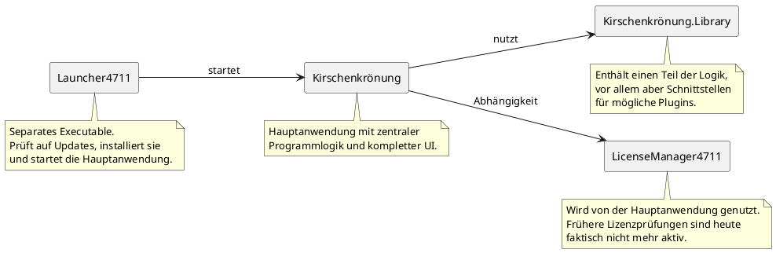

# Softwarearchitektur

Hier geht es um technische Details der Softwarearchitektur und Entwicklungsinfrastruktur.

## Framework/Technologie-Stack

* Die Software ist in C# geschrieben, das UI basiert auf WPF.
* Die Software wurde ursprünglich auf Basis des Microsoft .NET Framework entwickelt, im Laufe der Zeit jedoch zuerst auf .NET 6, dann .NET 8 und mittlerweile auf .NET 10 migriert.
* Die Lautstärkemessung erfolgt über die [NAudio](https://github.com/naudio/NAudio)-Bibliothek.
* Die Software ist modular aufgebaut und könnte bei Bedarf um eigene Seiten erweitert werden (siehe [Plugin-Schnittstelle](#plugin-schnittstelle)).

## CI/CD

* Aus historischen Gründen befinden sich die CI/CD Pipelines nicht direkt hier bei GitHub, sondern bei Azure DevOps
* Es gibt zwei zentrale Branches
    * Der `develop`-Branch für Integration und Testing
        * Build-Pipelines für jeden Commit, Release automatisch jeden Montag um 01:00 UTC
        * Status: Build  / Release 
    * Der `master`-Branch für fertige Releases
        * Build-Pipelines für jeden Commit, Release manuell ausgelöst
        * Status: Build  / Release 
* Der Launcher bzw. Updater kann konfiguriert werden, die neueste Softwareversion vom jeweiligen Branch zu verwenden (standardmässig wird natürlich das neueste Release des `master`-Branchs verwendet)
    * Um stattdessen ein aktuelleres Entwicklungs-/Testing-Release zu installieren, muss in der Datei `updateconfig.l4711` (im Installationsordner, also üblicherweise `%localappdata%\Kirschenkroenung\App`) in der ersten Zeile `master` zu `develop` geändert werden. 
    * Anschliessend das Programm beenden und den Launcher erneut starten - der Rest passiert automatisch. 
    * Analog dazu ist natürlich auch der Wechsel in die andere Richtung möglich.

## Update-Infrastruktur

* Die CI/CD-Pipelines kopieren die veröffentlichten Artefakte auf einen öffentlich erreichbaren Server.
* Der im Programm enthaltene Launcher bzw. Updater kontaktiert diesen Server und prüft, welche die für den jeweils konfigurierten Branch die neueste verfügbare Programmrevision ist. Die betreffenden URLs sind:
  * [https://api.studio-4711.com/UpdateCheck/master/Updatecheck.php](https://api.studio-4711.com/UpdateCheck/master/Updatecheck.php)
  * [https://api.studio-4711.com/UpdateCheck/develop/Updatecheck.php](https://api.studio-4711.com/UpdateCheck/develop/Updatecheck.php)
* Ist die dort verlinkte Revision eine andere als die gegenwärtig lokal vorhandene, wird sie heruntergeladen und installiert.

## Codebasis

* Hier und da sieht man dem leider Quellcode an, dass einige Features unter recht grossem Zeitdruck noch kurz vor dem Kirschenmarkt implementiert wurden. Dennoch hat sich die Software als äußerst robust erwiesen und ist bislang noch nie während der Veranstaltung abgestürzt.
* Zentrale Designphilosophie und Anforderungen:
    * Kompatibilität zwischen den Jahren spielt keine Rolle
    * Während der Wahl DARF das Programm einfach nicht abstürzen. 
        * Deshalb kann es hier praktisch gar nicht genug Null-Checks oder sonstige Prüfungen zur Erkennung dubioser Zustände geben
        * Deswegen auch Vorsicht mit Exceptions
    * In der Konfigurationsphase ist es nicht sooo tragisch, wenn es mal Probleme gibt
    * Das ganze läuft während der Veranstaltung auf einem Laptop mit unbekannten Specs; das Programm sollte Ressourcen also besser nicht gleich "mit der Baggerschaufel" allokieren (zugleich kann auch nicht erwartet werden, dass es auf jeder "Kartoffel" lauffähig ist)
    * Wenn es "nur UI-Code" ist, sind Tests keine absolute Priorität, aber wenn es zentrale Logik ist (und Fehler das Potenzial haben, das Festzelt in Rage zu versetzen...), muss es "wasserdicht" mit Unit Tests abgedeckt sein
    * Potenzielle Wiederverwendbarkeit für andere Veranstaltungen ist zweitrangig, zumindest einfache Änderungen am Design, Veranstaltungsablauf o.Ä. sollten aber ohne Programmänderungen machbar sein

## Komponenten

## Plugin-Schnittstelle

## Tests

## Historie

Für Software-Design relevante Ereignisse:

* 2017 wurde mit der Entwicklung des Programms begonnen (initial mit .NET 4.7)
* 2018 wurde das entworfene und prototypisch implementierte Messverfahren fachkundig reviewed und die Software kam erstmalig zum Einsatz
* 2018-2022 wurde das Programm um unzählige Features ergänzt, neben einer schier endlosen Zahl an "Kleinigkeiten" auch 
    * die Live-Anzeige von Instagram-Bildern zu wählbaren Hashtags
    * die Fernsteuerung der Software über ein Web-Interface (z.B. von einem iPad aus) 
    * der Kalibrierungsassistent zur Verbesserung der Messgenauigkeit
    * der Auto-Updater
* 2023 rückte die Reduktion des (bei einigen Features erheblichen!) Wartungsaufwands der Software in den Fokus, weswegen in den folgenden Jahren selten genutze Features mit zugleich hohem Wartungsaufwand wieder entfernt wurden (Instagram-Bilder, API und Web-Interface zur Fernsteuerung, Mechanismen für mögliche Lizenzprüfung)
* 2026 Review und Korrektur diverser dabei gefundener Fehler mit Claude Opus 4.8

Modernisierungen der Codebasis:

* 2020 Migration auf .NET 5
* 2022 Migration auf .NET 6
* 2024 Migration auf .NET 8
* 2026 Migration auf .NET 10