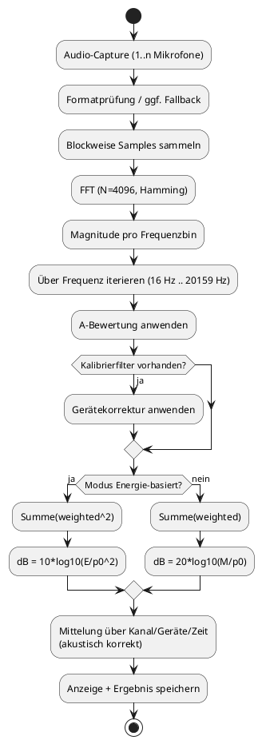

# Technischer Hintergrund: Schalldruckpegel‑Messung

Dieses Dokument erklärt, wie die Anwendung den **Schalldruckpegel** (typisch als dB(A) dargestellt) erfasst, verarbeitet und für die Bewertung nutzt. Das Dokument richtet sich insbesondere an Anwender der Software ohne spezielles technisches/physikalisches Vorwissen, hat aber den Anspruch akkurat genug formuliert zu sein, um auch möglichen kritischen Rückfragen fachkundiger Personen gerecht zu werden.

> ℹ️ **Schalldruckpegel**
>
> Schall sind kleine Druckschwankungen in der Luft. Je größer diese Schwankungen, desto höher der Schalldruckpegel. Angegeben wird er in Dezibel (dB) auf einer logarithmischen Skala. 
>
> Die logarithmische Skala bedeutet, dass gleiche Schritte auf der Skala gleichen Verhältnissen entsprechen, nicht gleichen absoluten Differenzen. Also konkret: Eine Eröhung um 10 dB bedeutet etwa eine Verzehnfachung. Eine Erhöhung um 20 dB bedeutet etwa den Faktor 100. Es geht also um "wie viel mal größer/kleiner", nicht um "plus X Einheiten". 
>
> Die Verwendung der logarithmischen Skala ist sinnvoll, weil sich Schallstärken über sehr grosse Bereiche erstrecken. Die logarithmische Skala macht diese Bereiche kompakt und gut vergleichbar. Zudem ist auch das menschliche Empfinden von Lautstärke nicht linear.

## Kurzüberblick
Die Anwendung misst über ausgewählte Mikrofone den zeitlichen Verlauf eines Audiosignals, verarbeitet das Signal frequenzbasiert (FFT), gewichtet es mit einer **A‑Bewertung** (dB(A)) und bildet daraus laufende sowie finale (gemittelte) Messwerte.

Zusätzlich kann pro Mikrofon eine Kalibrierung hinterlegt bzw. ermittelt werden, damit gerätespezifische Abweichungen bzw. Ungenauigkeiten (so gut wie möglich) kompensiert werden.

### Programmfunktionen (Capabilities)

- Mehrere Mikrofone und Kanäle parallel nutzbar.
- Laufende Anzeige von aktuellem Wert, Verlauf und zeitlichem Mittel.
- Konfigurierbare Messdauer (inkl. manueller Abbruch).
- A‑bewertete Pegelberechnung (dB(A)).
- Mikrofon‑Kalibrierung mit optionaler Frequenzganganalyse und persistente Speicherung der Kalibrierfilter pro Geräte‑ID.

### Grenzen der Messung (Limitations)

- Keine normgerechte Verwendung als geeichtes Schallpegelmessgerät.
- Ergebnisqualität hängt stark von Mikrofon, Raumakustik und Positionierung ab.
- Kalibrierung kann physikalische Grenzen der Hardware nicht aufheben (z. B. Clipping, enger Frequenzbereich).
- Frequenzgangkorrektur setzt voraus, dass der Kalibrier‑Testton ausreichend zuverlässig wiedergegeben wird.
- Unterschiede zwischen Betriebssystem‑Audio‑Pfaden, Treibern und Geräteeinstellungen können Einfluss nehmen.
- In der Praxis sind daher gute, "saubere" Messungen nah an spezialisierten Schalldruckpegelmessgeräten möglich. Die in einer Session durchgeführten Messungen sind daher zueinander fair vergleichbar - ein Vergleich von Messungen verschiedener Aufbauten bzw. Jahre o.Ä. ist aber nur sehr bedingt möglich.

## Grundlagen

> ℹ️ **Jeder hörbare Klang lässt sich als Mischung von Frequenzen beschreiben**
> 
> Ein realer Klang (z. B. Musik, Sprache, Jubel) besteht fast nie aus nur „einem Ton“, sondern aus vielen gleichzeitig vorhandenen Frequenzanteilen.
> 
> - **Frequenz** wird in Hertz (Hz) angegeben und bedeutet Schwingungen pro Sekunde.
> - Tiefe Töne haben niedrige Frequenzen (z. B. 100 Hz), hohe Töne hohe Frequenzen (z. B. 4000 Hz).
> - Ein Mikrofon nimmt ein Zeitsignal auf. Darin „stecken“ die Frequenzanteile gemischt.
> 
> Genau diese Mischung trennt die Anwendung rechnerisch in ihre Einzelteile auf (via FFT), um anschließend gezielt zu bewerten - denn das menschliche Ohr nimmt nicht alle Frequenzen gleich wahr.

> ℹ️ **FFT: Fast Fourier Transform**
>
> Die FFT ist ein mathematisches Verfahren, das ein Signal aus dem Zeitbereich in den Frequenzbereich überführt. Vereinfacht gesagt: Statt „Wie verläuft das Signal über die Zeit?“ erhält man „Welche Frequenzen sind enthalten und wie stark?“.
> 
> Warum das wichtig ist:
> - Nur im Frequenzbereich kann die A‑Bewertung sauber frequenzabhängig angewendet werden.
> - Ebenso kann eine frequenzabhängige Mikrofon‑Kalibrierung nur dort korrekt wirken.

> ℹ️ **(A‑)Bewertung eines Audiosignals**
>
> Es gibt verschiedene Arten, ein Audiosignal zu "bewerten". Bewerten heisst in diesem Fall, die Lautheit in einer Zahl auszudrücken.
> 
> Grob gesagt(!) werden bei einer Bewertung die Stärken der einzelnen im Audiosignal enthaltenen Frequenzen nach einer standardisierten Formel aufsummiert. Das Ergebnis ist der bewertete Schalldruckpegel. Abhängig von der genauen Bewertung können unterschiedliche Frequenzen unterschiedlich stark gewichtet werden.
>
> Gängige, standardisierte Arten der Bewertung sind die folgenden:
> * **dB(A)** → wenn es um wahrgenommene Lautstärke/Lärmbelastung für Menschen geht
(Alltag, Arbeitsschutz, Umgebungsgeräusche, „wie laut wirkt es?“).
> * **dB(C)** → wenn tieffrequente Anteile oder hohe Pegel stärker berücksichtigt werden sollen
(z. B. Basslastigkeit, Peak-/Impulsbewertung ergänzend zu dB(A)).
> *	**dB(Z) (unbewertet/linear)** → wenn ein physikalisch neutraler Referenzwert gebraucht wird
(technische Analyse, Vergleich von Messketten, nachgelagerte eigene Auswertung).
>
> Die A-Bewertung entspricht in vielen Fällen -ungefähr- den Eigenheiten des menschlichen Gehörs bei typischen Lautstärken. Bei dieser Bewertung werden sehr tiefe und sehr hohe Frequenzen stärker abgeschwächt, mittlere Frequenzen dagegen relativ stärker berücksichtigt.
>
> Ein rein physikalischer Pegel hingegen (ohne Bewertung) behandelt alle Frequenzen gleich. Menschen hören aber nicht alle Frequenzen gleich laut. Deshalb kann ein unbewerteter Messwert (z. B. dB(Z)) von der subjektiv empfundenen Lautstärke deutlich abweichen.
> Die A-Bewertung macht den Messwert also wahrnehmungsnäher und damit für praktische Lautstärke-/Lärmbewertung meist aussagekräftiger und ist in vielen praxisnahen Lärmanwendungen üblich.

> ℹ️ **Kalibrierung**
>
> Kalibrierung bedeutet hier: Die Abweichung zwischen
> 1) dem vom Programm gemessenen Schalldruckpegel und
> 2) einem Referenzmesswert (von einem speziellen Schallpegelmessgerät)
> wird genutzt, um Korrekturfaktoren für das Mikrofon zu berechnen (jedes Mikrofon ist ein bisschen anders; hat einen eigenen Frequenzgang).
>
> Mit diesen Korrekturfaktoren können anschliessend vom Programm gemessene Schalldruckpegel verrechnet werden, so dass das Ergebnis näher an dem Wert ist, den das spezialisierte Messgerät ermitteln würde.
> 
> Ziel: Künftige Messungen sollen realistischer und zwischen Geräten vergleichbarer werden.

> ⚠️ **Grenzen der Kalibrierung**
>
> Achtung: Die Kalibrierung ermöglicht jedoch NICHT einfach die Verwendung beliebiger Mikrofone! Viele Mikrofone nehmen z.B. Schall nur aus einem kleinen Bereich (optimiert für bestimmte Richtungen, bestimmte Entfernungen, ...), sind für einen bestimmten Frequenzbereich optimiert, haben einen zu geringen maximalen Schalldruckpegel, den sie überhaupt erfassen können, verzerren zu ungleichmässig/vorhersehbar/stark, etc.
>
> Trotz Kalibrierung sollten daher immer nur geeignete Mikrofone verwendet werden - und möglichst identische, falls die Messung mit mehreren gleichzeitig ausgeführt wird.

> ℹ️ **Frequenzgang**
>
> Der Frequenzgang beschreibt, wie stark ein Mikrofon auf verschiedene Frequenzen reagiert (gilt umgekehrt auch für Lautsprecher bei der Wiedergabe).
>
> - Idealer Frequenzgang (vereinfacht): möglichst gleichmäßige Empfindlichkeit über den relevanten Bereich (das Mikrofon reagiert also gleichermassen empfindlich auf hohe wie auf tiefe Töne).
> - Ungünstiger Frequenzgang: starke Überbetonung oder Abschwächung einzelner Bereiche (z. B. zu viel Bass, zu wenig Höhen).
>
> Folge in der Praxis: Das Messgerät „hört“ dann nicht neutral, und Pegel können je nach Klangspektrum systematisch verzerrt sein.

> ⚠️ **"Audioverbesserungen"**
>
> Windows (und auch diverse Drittanbieterprogramme) enthalten Funktionen, um Rauschunterdrückung, oder allgemein Audioverbesserungen, -optimierungen oder ähnlich auf Audiosignale anzuwenden.
> 
> Dies ist bei der Ausführung von Schalldruckpegeln jedoch problematisch und muss daher unbedingt deaktiviert werden!
>
> Der Grund: Das Audiosignal wird dabei (teils stark) verfälscht. Beispielsweise können dabei im Signal enthaltene Anteile in für Rauschen typische Frequenzen abgeschwächt oder ganz entfernt werden. Oder Signalteile im für menschliche Stimmen typischen Frequenzbereich können verstärkt werden.
> 
> Was für Online-Meetings praktisch sein kann, verfälscht so natürlich die Messergebnisse stark.

## Was wird gemessen?
Vom Programm gemessen wird der **Schalldruckpegel** als logarithmischer Pegel in **Dezibel**, in der Anwendung primär als **dB(A)**.

- **Schall** ist eine Druckschwankung in Luft.
- Der Pegel wird auf den Referenzdruck \(p_0 = 20\,\mu Pa\) bezogen.
- dB(A) bedeutet: Das Signal wird mit einer A‑Bewertung gefiltert, die die frequenzabhängige Empfindlichkeit des menschlichen Gehörs approximiert.

## Mögliche Fehler

Getreu dem Motto "was schiefgehen kann, wird schiefgehen" hier eine Auflistung von zu erwartenden Fehlern:

### Technische Störungen
- Mikrofonverbindung wird (kurzzeitig) unterbrochen oder Gerät liefert keine Werte.
- In diesem Fall wird die Messung als potenziell ungültig markiert (Warnhinweis), kann aber weiterlaufen.
- Bei dauerhaft fehlenden Werten (Schwellwert intern: mehrere fehlende Zyklen) wird ein Fehlerstatus ausgelöst.

### Signal-/Hardwareprobleme
- Übersteuerung (Clipping) bei zu hohem Pegel.
- Sehr billige oder stark gefärbte Mikrofone.
- Lautsprecher/Testquelle bei Kalibrierung mit eigenem starkem Frequenzfehler.
- Verfälschung der Kalibrierung durch Hintergrundgeräusche.
- Verfälschung von Kalibrierung oder Messung durch Audiooptimierungen von Windows oder Drittanbietersoftware.

### Umgebungsprobleme
- Hall, Reflexionen, Nebengeräusche, Wind, Handhabungsgeräusche.
- Geometriefehler: Mikrofon und Referenzmessgerät stehen nicht gleich.

## Worauf bei der Anwendung unbedingt achten?

1. **Mikrofone bewusst auswählen** (nur gewünschte, funktionierende Quellen).
2. **Messumgebung kontrollieren** (möglichst konstant, wenig Störgeräusch).
3. **Mikrofone konsistent positionieren** (Abstand/Ausrichtung beibehalten).
4. **Kalibrierung pro Mikrofon durchführen** und bei Hardwarewechsel wiederholen.
5. Bei Warnung „Mikrofonstörung“ Messung **prüfen und ggf. wiederholen**.
6. Bei Kalibrierung externe Referenzmessung sauber durchführen (am besten im typischen Zielbereich, für die Messung im Festzelt also ca. 80–90 dB(A)).

---

## Kalibrierung: Ablauf und Bedeutung

Die Kalibrierung erfolgt mikrofonspezifisch in mehreren Schritten:

### 1. Kalibrier-Messung
   - Weißes Rauschen wird wiedergegeben (oder externe Quelle genutzt).
   - Das Mikrofon misst intern; parallel misst ein externes Referenzgerät.
   - Der Referenzwert (dB(A)) wird manuell eingegeben.

> ℹ️ **Weißes Rauschen**
>
> Weißes Rauschen ist ein Signal, das viele Frequenzen gleichzeitig und in gleicher Stärke enthält.
> 
> Vereinfacht gesagt:
> - Es klingt wie ein gleichmäßiges „Rauschen“.
> - Im Kalibrierkontext ist es nützlich, weil viele Frequenzbereiche gleichzeitig angeregt werden.
> - Dadurch kann man erkennen, ob ein Mikrofon bestimmte Frequenzen über- oder unterbetont.
>
>Je nach exakter Definition kann „gleichmäßig“ auf unterschiedliche Skalen bezogen sein. Für das Kalibrierungsprozedere in dieser Anwendung ist wichtig, dass ein breitbandiges Testsignal verwendet wird.

### 2. Berechnung der Korrekturkoeffizienten
   - Ohne Frequenzanalyse: ein globaler Skalierungsfaktor (der für alle Frequenzen gleichermaßen gilt; also sozusagen wie ein Lautstärkeregler).
   - Mit Frequenzanalyse: frequenzabhängige Korrekturkurve + Gesamtskalierung.

### 3. Testmessung
   - Plausibilitätsprüfung der kalibrierten Messkette.
   - Bei auffälligen Korrekturwerten (zu klein/zu groß/zu stark schwankend) warnt die Anwendung.

### 4. Speicherung
   - Speicherung pro Mikrofon‑ID in `%AppData%/Kirschenkroenung/MicCalib/filters.json`.
   - Visualisierung der ermittelten Korrekturfaktoren

> ⚠️ **Gültigkeit der Kalibrierung**
>
> Eine Kalibrierung gilt immer nur für das konkrete Mikrofon (bzw. die konkrete Signalkette), mit der sie erstellt wurde.
> 
> Falls Mikrofon, Audiointerface o.Ä. einen Regler für die Lautstärke des Eingangssignals haben (und das gilt auch für den in Windows virtuell vorhandenen Regler für die Eingangslautstärke!), darf dieser nach der Kalibrierung nicht mehr verstellt werden - andernfalls ist die Kalibirierung ungültig!

> ℹ️ **„Guter“ vs. „schlechter“ Frequenzgang**
>
> Vereinfacht betrachtet:

> - **Gut für Messzwecke:** relativ glatt/gleichmäßig (keine extremen Spitzen und Einbrüche).
> - **Ungünstig:** starke Wellen, tiefe Einbrüche oder hohe Peaks in Teilbereichen.
> 
> Wichtig: „Gut“ bedeutet hier *messtechnisch neutral*, nicht unbedingt „klingt schön“. Ein Mikrofon kann subjektiv angenehm klingen, aber für Pegelmessungen dennoch ungeeignet sein.
>
> In der Visualisierung der ermittelten Korrekturfaktoren am Ende des Kalibrierungsassistenten ist ein Mikrofon je besser, je horizontaler und gerader die angezeigte Linie verläuft. Dies gilt jedoch nur, wenn die Analyse des Frequenzgangs während der Kalibrierung aktiviert wurde - andernfalls ist die Linie der Korrekturfaktoren immer gerade und horizontal verlaufend. (In der Visualisierung wird genau genommen auch nicht der eigentliche Frequenzgang, sondern eben die Korrekturfaktoren, um ihn rechnerisch zu neutralisieren, angezeigt.)

## Wie läuft die Messung technisch ab?

### 1. Erfassung der Eingangssignale
- Audioeingänge werden über Windows‑Capture‑Geräte (WASAPI, Shared Mode) verwendet.
- Es können mehrere Mikrofone parallel ausgewählt werden.
- Unterstützte Sampleformate:
        - PCM: 8/16/24/32 Bit
        - IEEE Float: 32/64 Bit
- Falls ein Format nicht direkt geeignet ist, wird ein Fallback auf IEEE‑Float versucht.

### 2. Zeit‑ in Frequenzbereich (FFT)
- Pro Kanal werden Blöcke mit **FFT‑Länge 4096** ausgewertet.
- Es wird ein **Hamming‑Fenster** verwendet, um Spektralleckeffekte zu reduzieren.
- Aus den FFT‑Bins werden Beträge (Magnituden) gebildet.
- Berücksichtigt wird der Frequenzbereich ca. **16 Hz bis 20159 Hz**.

### 3. Frequenzgewichtung (A‑Bewertung)
Jeder Frequenzanteil wird mit dem jeweiligen Faktor gemäß der A‑Bewertung multipliziert. Optional wird zusätzlich ein mikrofonspezifischer Korrekturfaktor aus der Kalibrierung angewendet.

In dieser Anwendung ist dB(A) als primärer Modus gewählt, da es für die vorgesehene Nutzung ein sinnvoller Standard ist (schließlich sollten die zahlenmäßig ausgedrückten Messwerte dem menschlichen Empfinden entsprechen).

### 4. Pegelbildung
Die Anwendung unterstützt zwei Rechenmodi:
- **Energie‑basiert** (bevorzugt): Summe der quadrierten gewichteten Beträge, anschließend
  \[
  L = 10 \log_{10}(E / p_0^2)
  \]
- **Magnitude‑Summen‑basiert** (Legacy): Summe der Beträge, anschließend
  \[
  L = 20 \log_{10}(M / p_0)
  \]

Die Magnituden-Summen-basierte Berechnung ist jedoch nur aus historischen Gründen im Programm enthalten und kann über das Feature-Flag `4711_LOUDNESSMEASURING_COMPUTATION_MODE` aktiviert werden. Andernfalls bzw. standardmäßig wird die (physikalisch korrekte) Energie-basierte Berechnung verwendet (die im Ergebnis zu etwas geringeren Zahlen führt).

### 5. Mittelung
Die Anwendung mittelt

- kanalübergreifend,
- geräteübergreifend,
- und über die Zeit

mit einer **akustisch korrekten logarithmischen Mittelung** (nicht einfach arithmetisch auf dB‑Werten).

> ℹ️ **Warum dB nicht direkt arithmetisch mitteln?**
>
> Dezibel sind logarithmisch. Für korrekte Mittelwerte werden dB‑Werte zuerst in lineare Größen umgerechnet, dort gemittelt und danach wieder in dB zurückgeführt.

> ⚠️ **Abtastraten bei Messungen mit mehreren Mikrofonen**
> Falls Messungen mit mehreren Mikrofonen gleichzeitig ausgeführt werden, muss vom Anwender sichergestellt werden, dass diese Signale in identischer Abtastrate liefern (bzw., wie bereits im Abschnitt der [Grundlagen](#grundlagen) erwähnt, idealerweise ohnehin identische Mikrofone).
> 
> Der Grund ist, dass die Verarbeitung der Audiosamples von den verschiedenen Geräten vom Programm nicht synchronisiert wird und daher auch die Bildung des Durchschnitts bei Signalen unterschiedlicher Abtastraten nicht konsistent bzw. korrekt wäre.

> ℹ️ Abtastrate
>
> Die Abtastrate (Sampling Rate) sagt, wie oft pro Sekunde ein analoges Audiosignal digital gemessen wird.
> 
> Einheit: Hertz (Hz)
> Beispiel: 44.100 Hz = 44.100 Messpunkte pro Sekunde
> 
> Warum wichtig:
> 
> - Sie bestimmt, wie fein das Signal zeitlich erfasst wird.
> - Sie begrenzt die maximal erfassbare Frequenz (Nyquist): ungefähr halbe Abtastrate.
>
> Beispiel: 44,1 kHz Abtastrate → bis ca. 22,05 kHz erfassbar.
> Kurz: Höhere Abtastrate kann mehr Frequenzinhalt erfassen, erzeugt aber auch mehr Daten.

Für jeden in der Visualisierung des Schalldruckpegels (während der Veranstaltung) eingezeichneten Datenpunkt wird das Mittel von drei (ggfs. bereits von verschiedenen Kanäle und Mikrofone gemittelten) Messwerten verwendet. Bei beispielsweise einer Abtastrate von 44.1 kHz ergeben sich dadurch ca. 3,6 in der Visualisierung eingezeichnete Datenpunkte pro Sekunde.

## Zusammengefasst: Warum misst das Programm, wie es misst?

- **FFT‑basierte Auswertung** erlaubt frequenzabhängige Gewichtung und Kalibrierfilter.
- **A‑Bewertung** erhöht die Praxisnähe für gehörbezogene Lautstärkevergleiche.
- **Mehrmikrofon‑Mittelung** stabilisiert Messungen und reduziert Einflüsse einzelner ungünstiger Positionen.
- **Kalibrierung pro Mikrofon** reduziert systematische Gerätefehler.
- **Robustheitslogik** (Fallbacks, Validitätsflag) soll Messabbrüche und instabile Betriebszustände minimieren.

## (Vereinfachtes) Prozessdiagramm

---

## Weiterführende Quellen
- Schalldruckpegel (Grundlagen): [Wikipedia: Schalldruckpegel](https://en.wikipedia.org/wiki/Sound_pressure#Sound_pressure_level)
- A-bewerteter Schalldruckpegel: [Wikipedia: A-Bewertung](https://en.wikipedia.org/wiki/A-weighting)
- Schnelle Fourier-Transformation: [Wikipedia: Fast Fourier Transform (FFT)](https://en.wikipedia.org/wiki/Fast_Fourier_transform)
