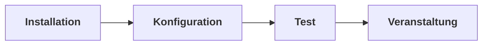

# Benutzerdokumentation

Dieser Bereich bündelt Informationen, die für die Bedienung der Software relevant sind. Weitere zum Verständnis und bei der Fehlersuche ggfs. relevante Hintergründe sind unter [Technischer Hintergrund](../technical/index.md) bzw. [Troubleshooting](../troubleshooting/index.md) beschrieben.

## Begrifflichkeiten

Einige in dieser Dokumentation und im Programm immer wieder verwendete Begriffe sind im Kapitel [Begrifflichkeiten](../begrifflichkeiten.md) beschrieben und möglicherweise für das Verständnis hilfreich.

## Phasen

Leider kann es nicht direkt mit der Wahl der Kirschenkönigin losgehen; stattdessen müssen bei der Verwendung des Programms grob diese typischen Prozessschritte durchlaufen werden:

### Installation

Damit ist gemeint, dass die Software auf dem Computer installiert wird, so dass sie anschliessend gestartet werden kann.

Neben Kirschenkrönung selbst muss, wie ebenfalls im entsprechenden Kapitel beschrieben, auch die möglicherweise notwendige Installation von Zusatzsoftware für die Mikrofone vom jeweiligen Hersteller bedacht werden. Weil diese erfahrungsgemäss manchmal etwas "zickig" sein kann, sollte das nicht erst kurz vor der Wahl passieren, damit ggfs. noch genug Zeit für die Fehlersuche bzw. -behebung bleibt.

Für Details, siehe [Kapitel Installation](installation.md).

### Konfiguration

In dieser Phase können diverse Einstellungen das Programm selbst betreffend angepasst werden, vor allem aber werden die Daten der Veranstaltung eingegeben.

Vor allem also natürlich:

* Informationen zu den Kandidatinnen werden eingegeben
* Der Veranstaltungsablauf wird festgelegt
* Alle Grafiken (Sponsoren-Logos usw.) werden gespeichert

Das Ergebnis dieser Phase ist ein Ordner mit Projektdaten, der alle eingegebenen Informationen und Dateien enthält.

Für Details, siehe [Kapitel Konfiguration](konfiguration.md).

### Test

Vor der Veranstaltung sollte der komplette Veranstaltungsablauf mindestens einmal durchgespielt werden - **unbedingt auch einschließlich der Lautstärkemessung mit den Mikrofonen, die während der Veranstaltung verwendet werden**.

Erfahrungsgemäss finden sich immer noch irgendwo kleine Eingabefehler, fehlerhafte Logos, suboptimale Einstellungen...oder es gibt Probleme mit den Mikrofonen.

"Irgendwas ist immer" gilt eben auch hier.

Für weitere Details, siehe [Kapitel Test](test.md).

### Veranstaltung

Am Ende steht natürlich die eigentliche Veranstaltung, also die Wahl der Kirschenkönigin. Prinzipiell sollte dieses natürlich möglichst nah am zuvor unter [Test](#test) erprobten Ablauf sein. Dennoch gibt es noch ein paar Hinweise auch dazu im Kapitel [Veranstaltung](veranstaltung.md).
